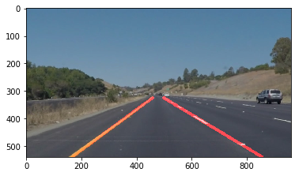

# **Finding Lane Lines on the Road** 

---

**Finding Lane Lines on the Road**

When we drive, we use our eyes to decide where to go. The lines on the road that show us where the lanes are act as our constant 
reference for where to steer the vehicle. Naturally, one of the first things we would like to do in developing a self-driving car is to 
automatically detect lane lines using an algorithm.

In this project I will detect lane lines in images using Python and OpenCV. OpenCV means "Open-Source Computer Vision", which is a 
package that has many useful tools for analyzing images.

---

### Reflection

### 1. Pipeline Description

My pipeline consisted of 5 steps:
1) Convert the image to grayscale.
2) Use Gaussian Blur to smooth the grayscaled image (with kernal 5).
3) Use Canny algorithm to find edges (with thresholds from 50 to 150).
4) Get the region of interest of trapezium shaped with 4 vertices.
5) Use Hough Transform on the masked image and weight the final output.

In order to draw the two lane lines (left and right), here are the steps:
1) Separate detected line segments with equation y = mx + b into left and right lane lines by calculating line slope m and value b. Positive slope is left lane line and negative slope is right lane line.
2) Calculate the average m value and b value within each list of left lane and right lane.
3) Draw two lines with y values of bottom and top of trapezium mask using the average m and b above. Those are two desired lane lines.

[//]: # (Image References)

### 2. Identify potential shortcomings with your current pipeline

One potential shortcoming would be what would happen when I test on the challenge video.
The challenge video has more extreme weather conditions such as sunlight, shades, etc. Also the vehicle is moving very fast.
Therefore, the algorithm hasn't been working on this yet.

### 3. Suggest possible improvements to your pipeline

A possible improvement would be to incorporate more algorithm on color spaces, gradient manipulation and other advanced algorithms to make the revised algorithm more robust and adaptable to extreme conditions.
